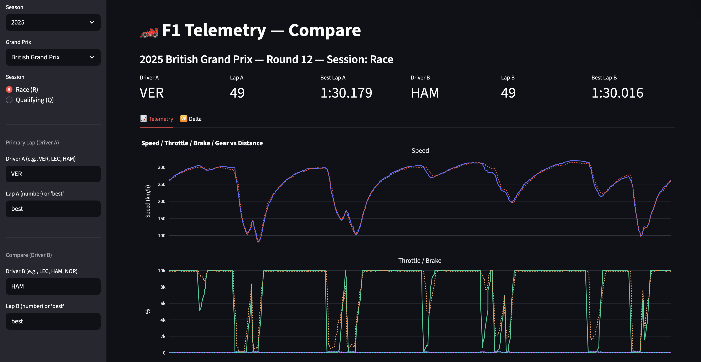
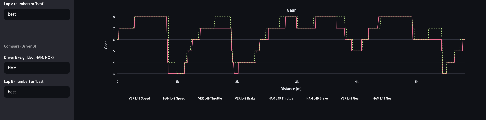
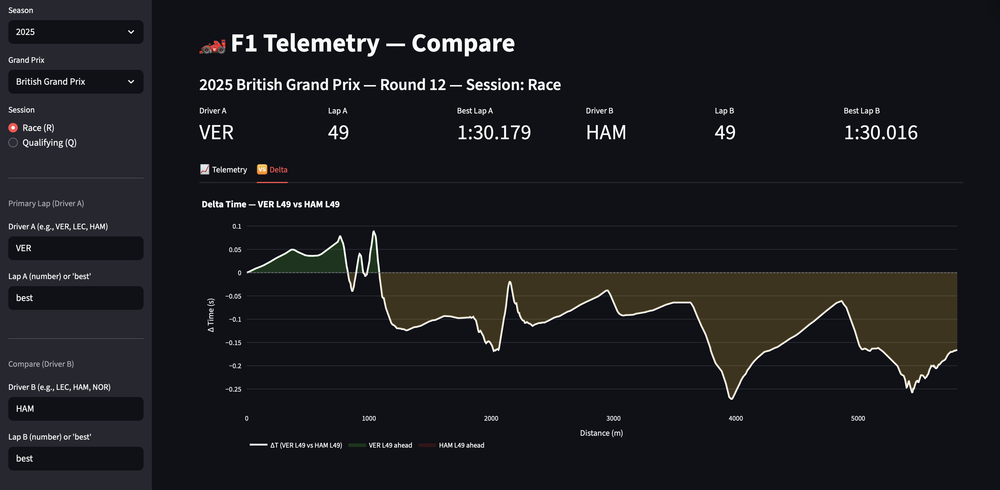

# 🏎️ F1 Telemetry — Compare

> “To all the kids out there who dream the impossible” — Sir Lewis Hamilton  

**F1 Telemetry — Compare** is an interactive web app designed to analyze and compare the telemetry data of Formula 1 drivers.  
Developed in **Python + Streamlit**, it leverages the official **[FastF1](https://github.com/theOehrly/Fast-F1)** API to extract and visualize speed, braking, throttle, and gear shifts throughout an entire race or qualifying lap.

The project was born from a passion for race engineering and technical analysis — combining **engineering, artificial intelligence, and interactive design** to deliver an experience similar to professional F1 telemetry systems used by real teams.

Link to Stremlit for try to use the F1-telemetry - Compare 👉 https://f1-telemetry-etvotq2zpj3uwxjwed6qwb.streamlit.app
---

## 🚀 Main Features

- 🏁 **Session Selection:** analyze any *Grand Prix* from 2020 onward, choosing between **Race** and **Qualifying**
- 👥 **Direct Driver Comparison:** e.g. `VER best lap` vs `LEC lap 43`
- 📊 **Interactive Plotly Graphs:**  
  - *Speed vs Distance*  
  - *Throttle / Brake vs Distance*  
  - *Gear vs Distance*
- ⏱️ **Enhanced Delta Time Plot:**
  - Displays in **green** the zones where Driver A is faster  
  - In **red** where Driver B gains time  
  - Zero reference line and dynamic hover tooltips
- ⚙️ **Physical distance (m)** is computed by integrating instantaneous speed — independent from FastF1’s cumulative distance  
- 🎨 **Responsive UI with dark theme**, inspired by F1 broadcast visuals  

---

## 🧠 How It Works

Telemetry data for each lap is reconstructed directly from raw FastF1 data:

1. Convert speed from km/h → m/s  
2. Integrate over time (`distance = ∫ v * dt`) to compute distance travelled  
3. Synchronize both drivers on the same *Distance (m)* axis  
4. Estimate cumulative lap time (proxy) to generate the **ΔTime**  

The output is a comprehensive visual analysis that reveals:
- where a driver brakes earlier or later  
- where throttle application starts sooner  
- where time is gained or lost  
- how gears evolve corner by corner  

---

## 🧩 Project Structure
F1-telemetry/
│
├── cache/                     # FastF1 cache to speed up loading times
├── web/
│   └── app.py                 # Main Streamlit web app
├── requirements.txt           # Dependencies
└── README.md                  # Project documentation

---

## ⚙️ Setup & Usage

### Clone the repository
git clone https://github.com/omareduardo1/F1-telemetry.git
cd F1-telemetry
#### Create and activate a virtual environment
python3 -m venv .venv
source .venv/bin/activate
#### Install dependencies
pip install -r requirements.txt
#### Run the app
streamlit run web/app.py
Then open 👉 http://localhost:8501 to explore the F1 telemetry dashboard
